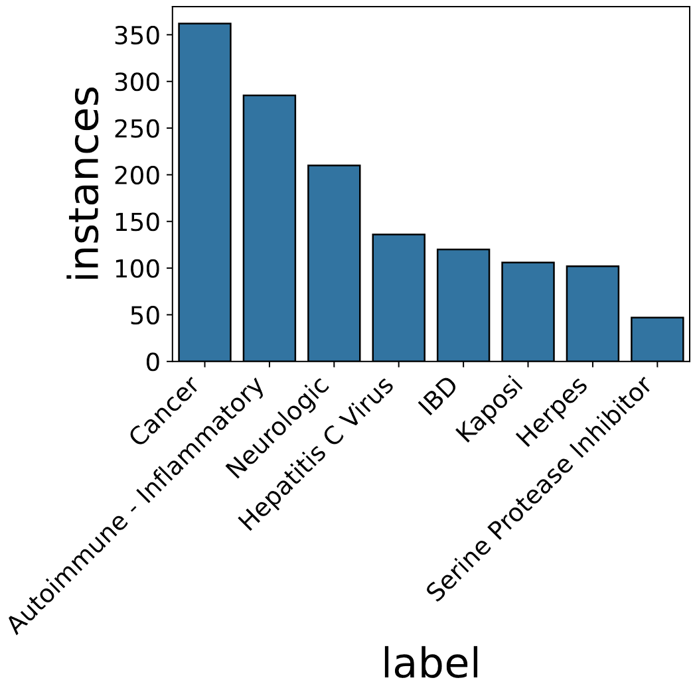
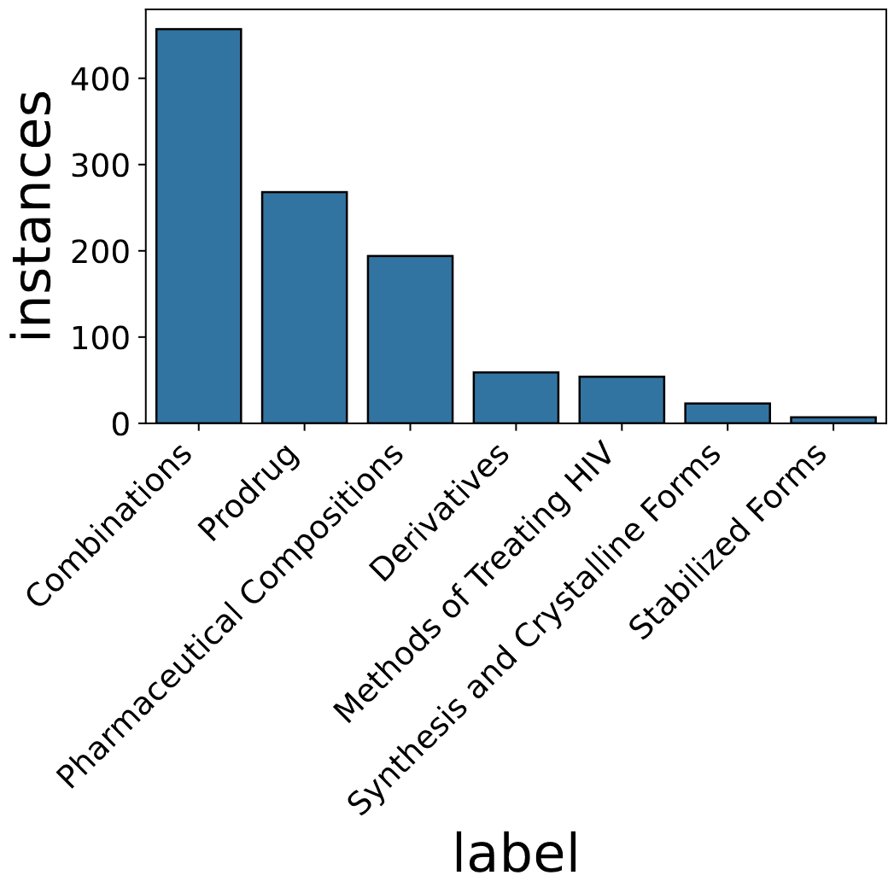
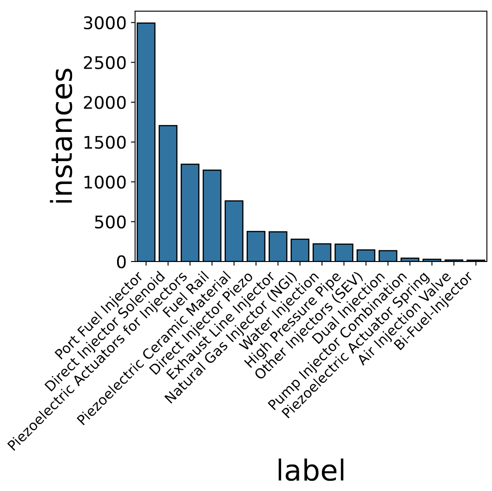

<!---

    Copyright (c) 2019 Robert Bosch GmbH and its subsidiaries.

-->

# Patent Landscape Study Resources

This repository contains the companion material for the following publication:

> Subhash Chandra Pujari, Jannik Strötgen, Mark Giereth, Michael Gertz, and Annemarie Friedrich. Three Real-World Datasets and Neural Computational Models for Classification Tasks in Patent Landscaping. In Proceedings of The 2022 Conference on Empirical Methods in Natural Language Processing. December 2022. Abu Dhabi.

Please cite this paper if using the dataset or the code, and direct any questions regarding the dataset
and code to subhashchandra.pujari@de.bosch.com.

## Purpose of this Software 

This software is a research prototype, solely developed for and published as part of the publication cited above. It will neither be maintained nor monitored in any way.


## The Patent Landscape Study Corpus

We release an open-source dataset to foster the research towards automating the Patent Landscape Study (PLS) process. As a use case of strategic importance, a patent landscape study identifies Intellectual Property relevant to a field, categorizes them into user-defined sub-categories, and analyzes them to draw business insights. We hereby release an in-house dataset created by a domain expert that comprised of patents relevant to **Injection Valve** categories representing different injection valve types and related techniques. Additionally, we enrich two WIPO datasets created during the Patent Landscape Study to track the research and development of the **Ritonavir** and **Atazanavir** drugs since the first invention. Below we provide details on each of the sub-datasets.

### Corpus File Formats

The datasets are provided inside the directory `patent_ls` containing a file for each dataset in CSV format.

```
patent_ls/
    atazanavir.csv
    ritonavir.csv
    injection_valve.csv 
```

Each row in these CSV files represents an entry corresponding to a patent family. Each dataset file contains eight columns. The columns `Title`, `Abstract`, `Claims`, `Description` contain the textual data of the patents.
The `Family Number` column uniquely identifies a patent family. The family members can be identified combining `Patent Number` and document `Kind Code`.
The content fields define the subject matter of the invention described within a patent document. 
Also, each patent is associated with two sets of labels, i.e., `CPC`, `IPC`, taken from Co-operative Patent Classification and International Patent Classification taxonomies. 
Finally, each document is associated with a set of target labels, specified in the `labels` column. A document might be associated with more than one label, thus making the classification to target categories a multi-label document classification task.

* `Family Number`
* `Patent Number`
* `Kind Code`
* `Title`
* `Abstract`
* `Claims`
* `Description`
* `CPC`
* `IPC`
* `labels`

Table 1. Dataset Statistics for three sub-datasets.

|  dataset       | Total Instances  | Number of unique labels   | Average labels per Instance| Year Range     |
|----------------|------------------|---------------------------|----------------------------|----------------|
|Atazanavir      |          640     |      8                    |            2.14            |  1998 - 2011   |
|Ritonavir       |          781     |      7                    |            1.35            |  1989 - 2010   |
|Injection Valve |         9483     |      16                   |            1.01            |  1920 - 2019   |


### WIPO Dataset

The first two Patent Landscape Studies have been performed by [WIPO](https://www.wipo.int) in the biochemical domain, i.e, on the drugs
[Ritonavir](https://www.wipo.int/publications/en/details.jsp?id=230&plang=EN) and [Atazanavir](https://www.wipo.int/publications/en/details.jsp?id=265&plang=EN). The dataset was generated as a part of a patent landscape study to track the research and development since the grant of the first patent for Ritonavir and Atazanavir drugs. We enrich the WIPO dataset with additional information taken from [PatBase API ](https://www.patbase.com/login.asp) including the machine translations by [MineSoft](https://minesoft.com/)/[RWS](https://www.rws.com/de/intellectual-property-services) in case of non-English text.

#### Atazanavir



**Figure 1.** The distribution of target class labels within the Atazanavir dataset.


The Atazanavir Patent Landscape Study identified the patents that are relevant to the research and development of Atazanavir drugs since the first filing. The target labels are a set of disease names for treatment of which Atazanavir has been found to be effective. We picked eight technical categories as disease names related to the HIV immune deficiency and relevant to the development of machine learning models.

#### Ritonavir



**Figure 2.** The distribution of target class labels within the Ritonavir dataset.

The Ritonavir Patent Landscape was performed to track the research and development following the first invention of Ritonavir drugs. The distribution of target labels is shown in Figure 2.


### Injection Valve Dataset

The Injection Valve dataset contains patent families related to injection valve and related technologies. The dataset has been created by a domain expert, analyzing the alerts from a patent alert system and labeling relevant documents. System alerts are based on a query using CPC/IPC codes as filters combined with a string match of `Fuel Injector` in the title field. As most of the patents are related to mechanical systems, the domain expert extensively used the accompanying figures within a patent document while making a relevancy decision.
The dataset is created using [PatBase API ](https://www.patbase.com/login.asp), with publication numbers as query. In case of non-English text, we use the machine translations provided by [MineSoft](https://minesoft.com/)/[RWS](https://www.rws.com/de/intellectual-property-services) .


     
**Figure 3.** The distribution of target class labels within the Injection Values dataset.


**Table 2.** The description of target labels.

|SNo.| Label                  |    Description                       |
|----|------------------------|--------------------------------------|
|  1 |Direct Injector Solenoid|(high pressure) fuel (gasoline) injection valve for injection directly into a combustion chamber of internal combustion engine driven by a solenoid (excluding Diesel injectors)|
|  2 |Air Injection Valve| fuel injection valve for injection of air|
|  3 |Exhaust Line Injector| dosing or metering valve for injection of fluids into an exhaust line (for instance, AdBlue)|
|  4 |Natural Gas Injector (NGI)| (low or high pressure) fuel injection valve for injection of gaseous fuel (CNG, as well LNG, LPG, hydrogen) into an intake port or manifold or directly into a combustion chamber of the internal combustion engine (excluding injectors for stationary engines or similar like Diesel engines)|
|  5 |Fuel Rail| rails, distributors, or accumulators for all usages in internal combustion engines (low or high-pressure gasoline, Diesel common rails, CNG rails, and so on)| 
|  6 | High-Pressure Pipe|pipes for providing high-pressure fuel and/or connecting injection valves and/or distributors/rails, especially also connecting faces|
|  7 |Piezoelectric Ceramic Material| ceramic material suitable for usage in piezoelectric actuators for injectors|
|  8 |Port Fuel Injector|(low pressure) fuel (gasoline) injection valve for injection into an intake port or manifold of internal combustion engine driven by a solenoid normally or biased by fuel pressure|
|  9 |Bi-Fuel-Injector|injection valve suitable for two different fuels for injection in an internal combustion engine (mostly one gaseous and one liquid fuel or two different liquids or two different gases)|
| 10 |Dual Injection|dual injection or twin injection comprising at least two injectors (for instance, combination of port fuel injector and direct injector or two different direct injectors for injection of same or different gaseous or liquid fuels)|
| 11 |Other Injectors (SEV)|all injection valves not matching the other portfolios (strange designs or usages)|
| 12 |Direct Injector Piezo|(high pressure) fuel (gasoline) injection valve for injection directly into a combustion chamber of internal combustion engine driven by a piezoelectric or magnetostrictive actuator (excluding Diesel injectors)|
| 13 |Pump Injector Combination|combination of injection function and pump function within one assembly (excluding Diesel applications)|
| 14 |Water Injection|all components and system aspects relating to water injection or water admixture, not limited to injection valves|
| 15 |Piezoelectric Actuators for Injectors|piezoelectric or magnetostrictive actuators suitable for usage in injection valves generally|
| 16 |Piezoelectric Actuator Spring|specific springs for preloading piezoelectric actuator modules suitable for usage in piezo injection valves (only a specific and subordinated topic)|


## Code

*tba*

### Installation Requirements

*tba*

## License
The manual labeled dataset created for the Patent Landscape Study located in the folder [patent_ls](patent_ls) is licensed under a [Creative Commons Attribution 4.0 International License](http://creativecommons.org/licenses/by/4.0/) (CC-BY-4.0).
